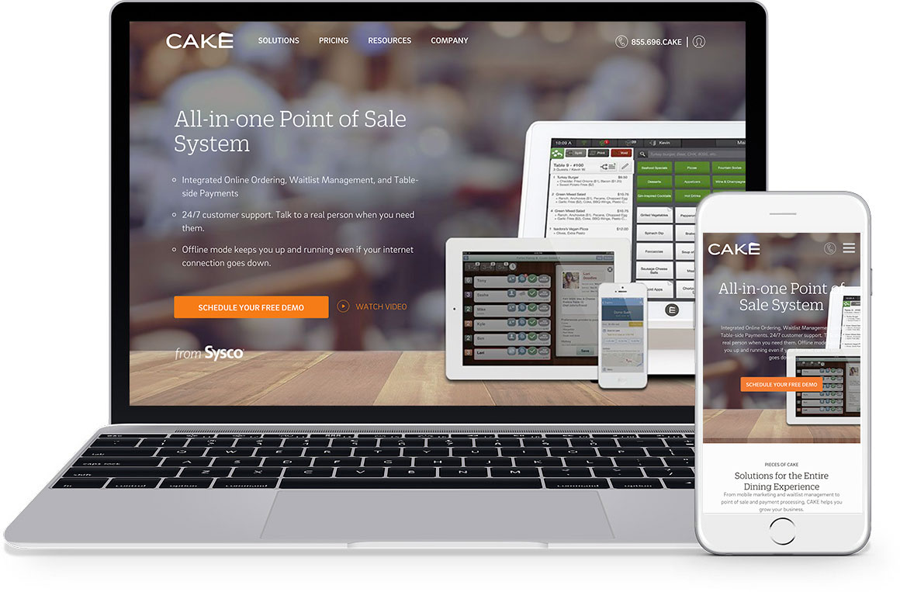

<figure class="figure figure--center no-border">
  
  <figcaption class="figure__caption">Homepage Layout</figcaption>
</figure>

My responsibilities in this project included HTML5/CSS3 and PHP. It was a very technical and well-structured website, with many different types of content, includng Products and FAQs and Testimonials, just to name a few.

I worked closly with the marketing team, various product stakeholders, and the sales team to help them figure out the requirements and custom functionality needed.

<figure class="figure figure--center no-border">
  
  <figcaption class="figure__caption">Landing Page Layout</figcaption>
</figure>
