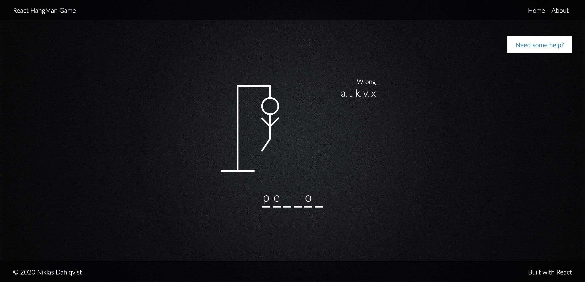

A simple React HangMan game made with Create-React-App. This was a learning exercise for me to get into and play around with React and React Hooks.

<figure class="figure figure--center">
  
  <figcaption class="figure__caption">A simple React Hangman game.</figcaption>
</figure>

It is based on a tutorial from the [Traversy Media YouTube channel](https://www.youtube.com/c/TraversyMedia).

But I extended it a bit, by adding a [random word generator](https://www.npmjs.com/package/random-words) and the [OwlBot API](https://owlbot.info/) for word lookups. The OwlBot API enabled me to extend this relatively simple game, with other functionalty like a hint system.

## Installation

- Go to [OwlBot](https://owlbot.info/) and sign up for an API key.
- `git clone git@github.com:DalkMania/react-hangman.git`
- `cd react-hangman`
- `npm install or yarn`
- Put your OwlBot API key in the `.env.example` file and rename it to `.env`
- `npm run start or yarn start`
- Visit http://localhost:3000/
