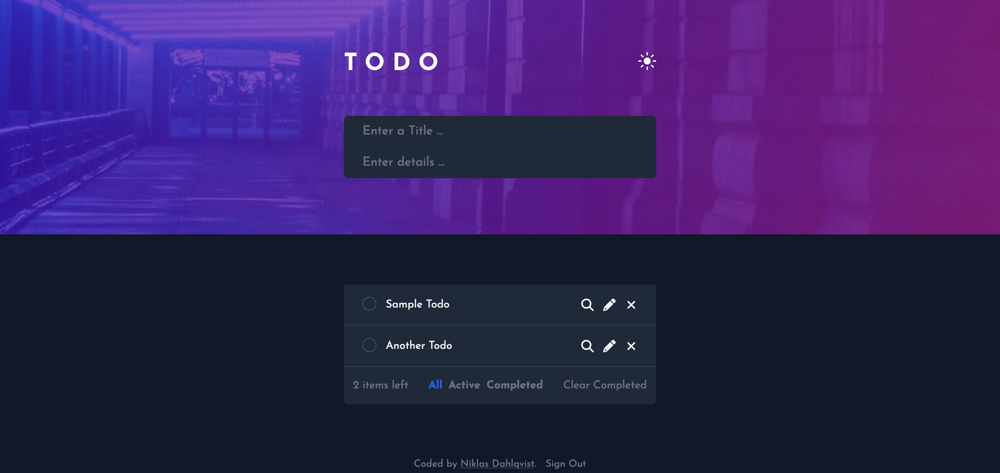
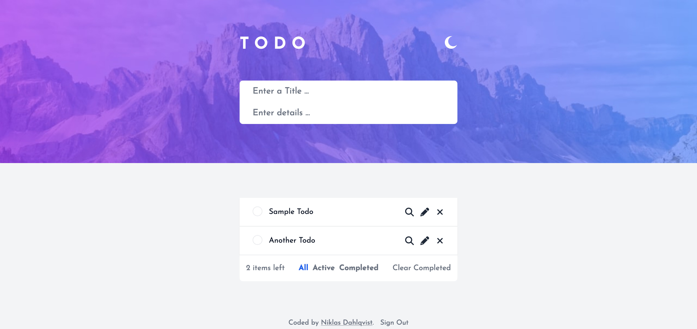

This is an application based on the [Todo app challenge on Frontend Mentor](https://www.frontendmentor.io/challenges/todo-app-Su1_KokOW). Frontend Mentor challenges help you improve your coding skills by building realistic projects. I extended the challenge by adding some extra fields and functionality. Such as authorization, login with google. I did this, to be able to have multiple users.

## Overview

<figure class="figure figure--center">
  
  <figcaption class="figure__caption">Todo App Dark Mode.</figcaption>
</figure>

<figure class="figure figure--center">
  
  <figcaption class="figure__caption">Todo App Light Mode.</figcaption>
</figure>

### The challenge

Users should be able to:

- View the optimal layout for the app depending on their device's screen size
- See hover states for all interactive elements on the page
- Add new todos to the list
- Mark todos as complete
- Delete todos from the list
- Filter by all/active/complete todos
- Clear all completed todos
- Toggle light and dark mode
- **Bonus**: Build this project as a full-stack application

### Links

- Solution URL: [https://github.com/DalkMania/nextjs-crud-todo-app](https://github.com/DalkMania/nextjs-crud-todo-app)
- Live Site URL: [https://dalkmania-nextjs-crud.netlify.app](https://dalkmania-nextjs-crud.netlify.app)

## Built with

- [Next.js](https://nextjs.org/)
- [NextAuth.js](https://next-auth.js.org/)
- [Tailwind CSS](https://tailwindcss.com/)
- [Supabase](https://supabase.com/)
- [Prisma](https://www.prisma.io/)
- [Netlify](https://netlify.com/)

### What I learned

This project was a good practice to test my React and Tailwind CSS skills. First time, I used NextAuth.js, Prisma and Supabase. To build a feature complete CRUD application.

## How to use

1. `git clone git@github.com:DalkMania/nextjs-crud-todo-app.git`
2. `cd nextjs-crud-todo-app`
3. `npm install`
4. Copy the `env.example` file to `.env`
5. Put your API keys for the different services in the `.env` file
6. `npm run dev`
7. Visit `http://localhost:3000/`
